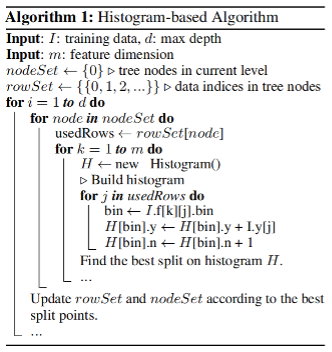

# Related Works & Data Preprocessing

## 相关工作

我们使用的是基于梯度提升决策树（GBDT）的LightGBM2算法，LightGBM2算法结合了基于梯度的单边取样技术（GOSS）和独家特征捆绑技术（EFB）。

**梯度提升决策树（GBDT）：** GBDT是一个决策树的集合模型，它是按顺序训练的。在每个迭代中，GBDT通过拟合负梯度（也称为剩余误差）来学习决策树。GBDT的主要成本在于学习决策树，而学习决策树中最耗时的部分是寻找最佳分割点。寻找分割点的最流行的算法之一是预排序算法，预排序算法列举了预排序特征值上所有可能的分割点。这种算法很简单，可以找到最佳的分割点，但是它在训练速度和内存消耗方面都很低效。另一种流行的算法是基于直方图的算法，如下图。 基于直方图的算法不是在排序的特征值上寻找分割点，而是将连续的特征值放入离散的仓中，并在训练中使用这些仓来构建特征直方图。



**基于梯度的单边取样（GOSS）：** 虽然在GBDT中没有数据实例的原生权重，但是具有不同梯度的数据实例在信息增益的计算中发挥着不同的作用。特别是根据信息增益的定义，那些具有较大梯度的实例（即训练不足的实例）将对信息增益做出更大贡献。因此，在对数据实例进行向下抽样时，为了保持信息增益估计的准确性，我们应该更好地保留那些具有大梯度的实例（例如，大于预先定义的阈值，或属于最高百分比的实例），而只随机放弃那些具有小梯度的实例。已经有相关文献证明，在目标采样率相同的情况下，这样的处理方式比均匀的随机采样能带来更准确的增益估计，特别是当信息增益值有较大范围时。

**独家特征捆绑（EFB）：** 通常来说，实际应用中虽然有大量的特征，但特征空间是相当稀疏的，这就为我们设计一种几乎无损的方法来减少有效特征的数量提供了可能。具体来说，在稀疏的特征空间中，许多特征是几乎是排他的，也就是说，它们很少同时取非零值。这方面的例子包括单热特征。我们可以安全地捆绑这种排他性特征。为此，我们设计了一种高效的算法，将最优捆绑问题简化为图的着色问题（将特征作为顶点，如果它们不是互斥的，则为每两个特征添加边），并通过一种具有恒定近似率的贪婪算法来解决它。

## 数据预处理

首先对数据进行预处理，题目给的数据集有两个分别是：`train_public`和`train_internet`，由于`train_public`中的数据数目太少，所以使用`train_internet`数据集对原始数据集进行扩充。`train_public`数据集格式如下：

| 字段                     | 字段描述                                           |
| ------------------------ | -------------------------------------------------- |
| loan_id                  | 贷款记录唯一标识                                   |
| user_id                  | 借款人唯一标识                                     |
| total_loan               | 贷款数额                                           |
| year_of_loan             | 贷款年份                                           |
| interest                 | 当前贷款利率                                       |
| monthly_payment          | 分期付款金额                                       |
| grade                    | 贷款级别                                           |
| employment_type          | 所在公司类型（世界五百强、国有企业、普通企业...）  |
| industry                 | 工作领域（传统工业、商业、互联网、金融...）        |
| work_year                | 工作年限                                           |
| home_exist               | 是否有房                                           |
| censor_status            | 审核情况                                           |
| issue_month              | 贷款发放的月份                                     |
| use                      | 贷款用途类别                                       |
| post_code                | 贷款人申请时邮政编码                               |
| region                   | 地区编码                                           |
| debt_loan_ratio          | 债务收入比                                         |
| del_in_18month           | 借款人过去18个月逾期30天以上的违约事件数           |
| scoring_low              | 借款人在贷款评分中所属的下限范围                   |
| scoring_high             | 借款人在贷款评分中所属的上限范围                   |
| known_outstanding_loan   | 借款人档案中未结信用额度的数量                     |
| known_dero               | 贬损公共记录的数量                                 |
| pub_dero_bankrup         | 公开记录清除的数量                                 |
| recircle_bal             | 信贷周转余额合计                                   |
| recircle_util            | 循环额度利用率                                     |
| initial_list_status      | 贷款的初始列表状态                                 |
| app_type                 | 是否个人申请                                       |
| earlies_credit_mon       | 借款人最早报告的信用额度开立的月份                 |
| title                    | 借款人提供的贷款名称                               |
| policy_code              | 公开可用的策略_代码=1新产品不公开可用的策略_代码=2 |
| f系列匿名特征            | 匿名特征f0-f4，为一些贷款人行为计数特征的处理      |
| early_return             | 借款人提前还款次数                                 |
| early_return_amount      | 贷款人提前还款累积金额                             |
| early_return_amount_3mon | 近3个月内提前还款金额                              |

`train_internet`的数据格式如下：

| 字段                     | 字段描述                                                       |
| ------------------------ | -------------------------------------------------------------- |
| loan_id                  | 网络贷款记录唯一标识                                           |
| user_id                  | 用户唯一标识                                                   |
| total_loan               | 网络贷款金额                                                   |
| year_of_loan             | 网络贷款期限（year）                                           |
| interest                 | 网络贷款利率                                                   |
| monthly_payment          | 分期付款金额                                                   |
| class                    | 网络贷款等级                                                   |
| sub_class                | 网络贷款等级之子级                                             |
| work_type                | 工作类型（公务员、企业白领、创业...）                          |
| employment_type          | 所在公司类型（世界五百强、国有企业、普通企业...）              |
| industry                 | 工作领域（传统工业、商业、互联网、金融...）                    |
| work_year                | 就业年限（年）                                                 |
| house_ownership          | 是否有房                                                       |
| house_loan_status        | 房屋贷款状况（无房贷、正在还房贷、已经还完房贷）               |
| censor_status            | 验证状态                                                       |
| marriage                 | 婚姻状态（未婚、已婚、离异、丧偶）                             |
| offsprings               | 子女状态(无子女、学前、小学、中学、大学、工作)                 |
| issue_date               | 网络贷款发放的月份                                             |
| use                      | 贷款用途                                                       |
| post_code                | 借款人邮政编码的前3位                                          |
| region                   | 地区编码                                                       |
| debt_loan_ratio          | 债务收入比                                                     |
| del_in_18month           | 借款人过去18个月信用档案中逾期60天内的违约事件数               |
| scoring_low              | 借款人在信用评分系统所属的下限范围                             |
| scoring_high             | 借款人在信用评分系统所属的上限范围                             |
| pub_dero_bankrup         | 公开记录清除的数量                                             |
| early_return             | 提前还款次数                                                   |
| early_return_amount      | 提前还款累积金额                                               |
| early_return_amount_3mon | 近3个月内提前还款金额                                          |
| recircle_bal             | 信贷周转余额合计                                               |
| recircle_util            | 循环额度利用率，或借款人使用的相对于所有可用循环信贷的信贷金额 |
| initial_list_status      | 网络贷款的初始列表状态                                         |
| earlies_credit_line      | 网络贷款信用额度开立的月份                                     |
| title                    | 借款人提供的网络贷款名称                                       |
| policy_code              | 公开策略=1不公开策略=2                                         |
| f系列匿名特征            | 匿名特征f0-f5，为一些网络贷款人行为计数特征的处理              |

首先排除掉两个数据集中互斥的属性：

```py
internet_drop = ['user_id', 'sub_class', 'work_type', 'house_loan_status', 'marriage', 'offsprings', 'f5']
data_drop = ['user_id', 'known_outstanding_loan', 'known_dero', 'app_type']

def process_column(self, train_data: DataFrame, test_data: DataFrame, train_internet: DataFrame):
    """属性对齐"""
    train_internet.drop(self.internet_drop, axis=1, inplace=True)
    # 将isDefault改为is_default
    train_data["is_default"] = train_data["isDefault"]
    train_data.drop(self.data_drop + ["isDefault"], axis=1, inplace=True)
    test_data.drop(self.data_drop, axis=1, inplace=True)
```

属性对齐后就可以将`train_public`、`test_public`和`train_internet`三个表合并成一个数据集。由于数据集中的一些格式还未规范，所以还需要将数据集中的列属性以及格式进行调整：

```py
def process_column_type(self, data: DataFrame):
    """处理数据类型"""
    # 处理日期
    data['issue_date'] = pd.to_datetime(data['issue_date'])
    data['issue_mon'] = data['issue_date'].dt.year * 100 + data['issue_date'].dt.month
    data.drop(['issue_date'], axis=1, inplace=True)
    data['work_year'] = data['work_year'].map({
        '< 1 year': 0, '1 year': 1, '2 years': 2, '3 years': 3, '4 years': 4,
        '5 years': 5, '6 years': 6, '7 years': 7, '8 years': 8, '9 years': 9,
        '10+ years': 10
    })
    data['class'] = data['class'].map({
        'A': 0, 'B': 1, 'C': 2, 'D': 3,
        'E': 4, 'F': 5, 'G': 6
    })
    data['work_year'].fillna(-1, inplace=True)
    # 处理earlies_credit_mon中的月份
    data['earlies_credit_mon'] = data['earlies_credit_mon'].apply(self.clean_mon)
```

首先是将日期格式统一成`pandas`包的统一`datetime`格式，然后将`work_year`属性规范成0～10的整数，`class`属性规范成0～6的整数，处理完属性格式后需要对原数据集中的一些枚举字段（`employer_type`、`industry`）进行编码。这里可以使用`sklearn`包中的`LabelEncoder`模块进行自动的编码。

```py
def label_encode(self, data: DataFrame):
    """字符串编码"""
    employer_type_encoder = LabelEncoder()
    data['employer_type'] = employer_type_encoder.fit_transform(data['employer_type'])
    industry_encoder = LabelEncoder()
    data['industry'] = industry_encoder.fit_transform(data['industry'])
```

经过上述处理后得到最终的即将训练的数据集。为了加快后续训练的读取速度，将以上处理好的数据以Feather格式缓存到磁盘上，加速后续数据集的读取速度。Feather是一种用于存储数据帧的数据格式，是一种高速读写压缩二进制文件。Feather 其实是Apache Arrow 项目中包含的一种数据格式，但是由于其优异的性能，该文件格式也被单独打包，放在pip中进行安装。Pandas 也支持对Feather的读写，所以只需安装pandas即可。这样以后每次调整训练器的超参数时只需要从Feather格式的数据集中读取即可。
